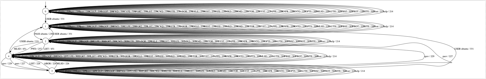

# ftp-statemodel-learner

Modification on LearnLib to infer every FTP state model via **Active Learning**.

## Setting the configuration file
Before running the learner, you need to edit the *config.properties*. Here you find a typical setup:
  
- **ip**: 127.0.0.1
    
    [*ip target*] 
- **port**: 2200

    [*server port*]
- **commands**: USER ubuntu,NOOP,PWD,TYPE,PORT,CDUP,CWD,RETR,ABOR,DELE,PASS ubuntu,REST,SIZE,MKD,RMD,STOR,SYST,APPE,RNFR,RNTO,OPTS,AUTH,PBSZ,PROT,SITE

     [*list of commands, separated by a comma*]
- **responsesToIgnore**: 150,220,214

    [*some of the responses are either not important for the learning process or are sent before the proper response. We need to ignore these responses*]
- **debug**: true

    [the default value is false] 

- **resetCommand**: QUIT

    [*the command used by FTP to close a session. You don't have to add this command into "commands"*]

## Running the learner 

- **Via jar file:**
    1. java -jar ftpLearner.jar
    
- **via Eclipse:**
    1. File -> Open Project from File System 
    2. Select the project
    3. Run it

## Output 

If you enable the debug mode, you can see every request and response:

After a few seconds, the inferred state model is saved in a .dot file:

