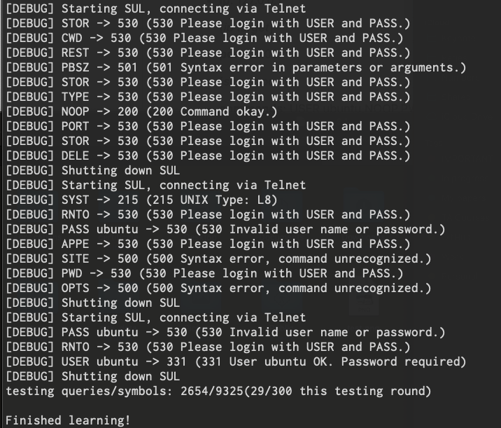
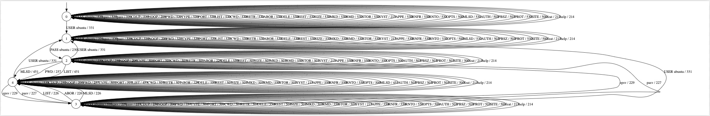
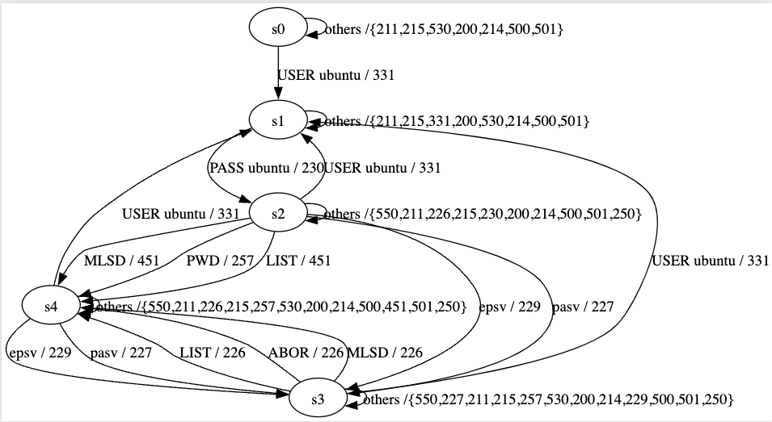

# ftp-statemodel-learner

LearnLib harness to infer every FTP state model via **Active Learning**.

## Setting the configuration file
Before running the learner, you need to edit the *config.properties*. Here you find a typical setup:
  
- **ip**: 127.0.0.1
    
    [*ip target*] 
- **port**: 2200

    [*server port*]
- **commands**: USER ubuntu,NOOP,PWD,TYPE,PORT,CDUP,CWD,RETR,ABOR,DELE,PASS ubuntu,REST,SIZE,MKD,RMD,STOR,SYST,APPE,RNFR,RNTO,OPTS,AUTH,PBSZ,PROT,SITE
     [*list of commands, separated by a comma*]
    **NB**:You don't have to add the *QUIT* command
- **debug**: true

    [the default value is false] 

## Running the learner 

- **Via jar file:**
    1. java -jar ftpLearner.jar
    
- **via Eclipse:**
    1. File -> Open Project from File System 
    2. Select the project
    3. Run it

## Output 

If you enable the debug mode, you can see every request and response:

The inferred state model is saved in a .dot file:

*Light FTP state model*
## Cleaning the state model
If you want to merge all the clouds into a single edge labelet with **"others/{list of response codes}"**, you can run the script simplify_model.py
> python3 simplify_model.py <input_file> <output_file>

to obtain something like this:

*Light FTP state model*

## Case studies 

Implementation | Inferred | Number of states |
--- | --- | --- | 
[*Light FTP*](./State%20models/Light%20FTP.png) | Yes | 5 |
[*bftpd*](./State%20models/bftpd.png ) | Yes | 7 |
*ProFTPd* | No | ? |
*pure-ftp* | No | ? |

## Todo

1. Trying to run ProFTPd state models, the learner cannot handle the second response after the list command.
   
   It should save **226 Transfer complete. Closing data connection.** but it's stuck with the message **150 Opening ASCII mode data connection for file list**.

